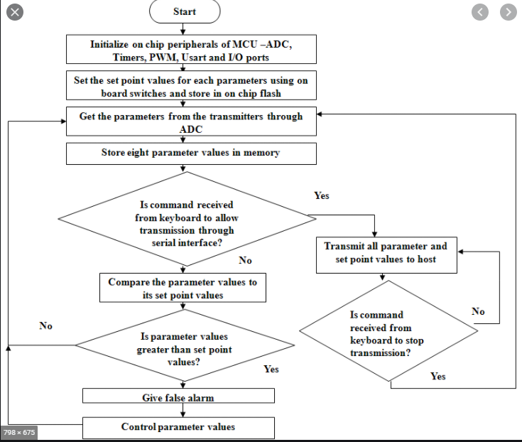
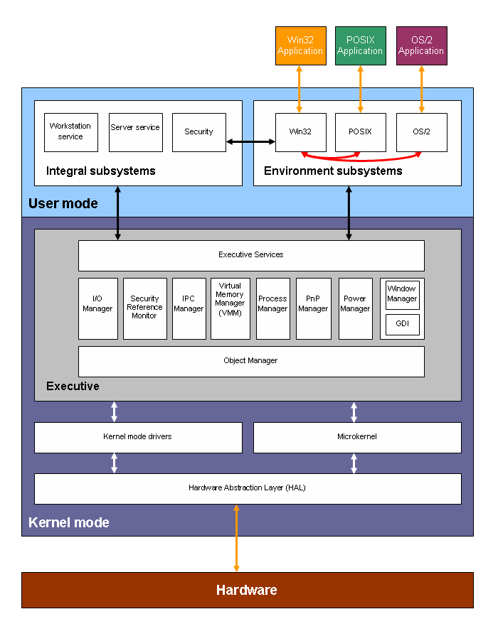

# Code Design   
- [Tools](#Tools)   
    - [Flow Diagram](#Flow-Diagram)   
    - [Software Block](#Software-Block)   
    - [Component Design](#Component-Design)   
- [Standarization](#Standarization)   
    - [Versions of C Standard](#Versions-of-C-Standard)   
        - [C11](#C11)   
        - [C99](#C99)   
        - [C89/C90](#C89/C90)   
        - [K&R C-Programming](#K&R-C-Programming)   
- [Coding Guideline](#Coding-Guideline)   
- [Coding Standards](#Coding-Standards)   
- [File Structure](#File-Structure)   
    - [Header File](#Header-File)   
    - [Implementation File](#Implementation-File)   
- [Platform](#Platform)   
    - [Native](#Native)   
    - [Cross](#Cross)   
- [Libraries](#Libraries)   
- [Modules](#Modules)   
# Tools   
## Flow Diagram  
---   

 
   
## Software Block  
---   

 
## Component Design  
---   
A Component Design is a specification for an Adaptable Component that can be used to construct a draft application work product.  

# Standarization  
Standards provide specific syntax and features what each version of the language supports 
## Versions of C Standard  
---   
- C11
- C99
- C89/c90
- K&R C-programming
   
# Coding Guideline  
- MISRA C Coding Guideline - Motor Industry Software Reliability Association [LINK](https://www.perforce.com/resources/qac/misra-c-cpp)
- Ganssle's "Firmware Development Standard" [LINK](http://www.ganssle.com/fsm.htm)

# Coding Standards Example   
- Header - A function prototype  that's really informative commented sections
- Constant information will  be represented with all capitals
- Variable names are all lowercase with their name maps with the purpose of the variable
- Indentations and newlines are used to help with readability
- Numbers in array indentation is used for multi line statements 
- Variable values and function parameters both have commas and spaces to separate each item
# File Structure   
## Header File  
---  
[Template](https://github.com/richanynguon/PathToHokage/blob/master/Embedded_System/coursera_ese/src/Document_Templates.md) 

## Implementation File  
---   
[Template](https://github.com/richanynguon/PathToHokage/blob/master/Embedded_System/coursera_ese/src/Document_Templates.md) 

# Platform   
- Native
- Cross Platform
   
# Libraries  
Collection of software (precompiled or direct source) 
Question you should Ask when including precompiled libraries:
If library is precompiled:
- Is it compiled for my architecture?
- Was this designed to be optimized for my architecture?
- If you have a full library source code:
- What software feature does this use
- What other code does this include?

String and stdio libraries - they are optimized but only for the instruction set architectures, but not for the specific platform you're using
Is there hardware offloading that can increase performance?
What are internal memory requirements does this require?  
- Static Libraries: Directly linked into your output exectuable
    - Installed with program image as part of the exectuable
    - create using archiver

- Shared Libraries: Linked dynamically at runtime with your executable
    - pre-installed onto target
    - used for applications with an operating system
    - create shared flag

# Modules   
Software organization that each module has encapsulated certain functionality within a library

When you define your own modules, give it a descriptive name relating to functionality - give a similar all caps name to include guard preprocessing  

- Module Design
- Where do the logical boundaries exist?
- What have architecture dependencies?
- What have platform dependencies?

