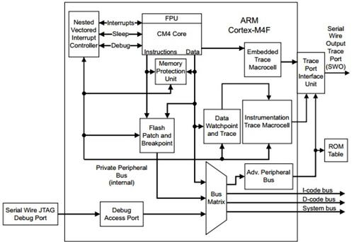
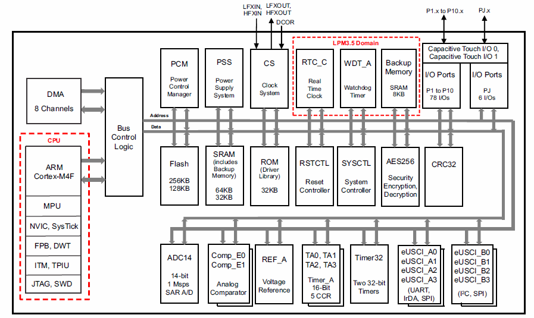
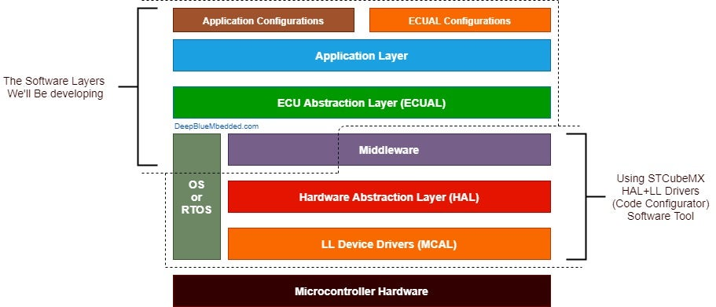

# Systems Architecture   
- [Hardware](#Hardware)
    - [Platform](#Platform)
    - [CPU](#CPU)   
        - [ALU](#ALU)   
        - [Registers](#Registers)   
        - [Control](#Control)   
        - [Interrupt Handler](#Interrupt-Handler)   
        - [Cache](#Cache)   
    - [Peripherals](#Peripherals)      
        - [GPIO](#GPIO)
    - [RAM](#RAM)   
    - [Flash](#Flash)   
    - [ROM](#ROM)  
    - [General Modern Microcontrollers Include](#General-Modern-Microcontrollers-Include)
        - [ADC](#ADC)
        - [DAC](#DAC)  
        - [Clock](#Clock)  
- [Software](#Software)   
    - [Instruction Size](#Instruction-Size)
    - [Hardware Abstraction Layer](#Hardware-Abstraction-Layer)   
        - [Drivers](#Drivers)   
        - [Bare Metal Firmware](#Bare-Metal-Firmware)   
    - [Bootloader](#Bootloader)   
    - [Operating Systems](#Operating-Systems)   
    - [Libraries and Middleware](#Libraries-and-Middleware)   
    - [Applications](#Applications)   
# Hardware   
  
MSP432 System Architecture
  
MSP432 block diagram

## Platform
---
The platform is the underlying integrated circuit (IC) and the components surrounding the CPU (Peripherals). This is a relative term but could also refer to an OS or circuit board with an IC. This m,ay affect the address space of the micro controller.
## CPU  
---   
Central Processing Unit (CPU) is the unit that executes instructions that make a computer program through i/o operations.  

Operation  
- Fetch
- Decode
- Execute

These intructions helps the CPU process Arithmetic, Logic and Data Transfer operations.

The underlying integrated circuit I

#### ALU
---
A combinational digital electronic circuit that performs arithmetic and bitwise operations on binary intergers.  

Inputs or data to the ALU are referred as operands.   
Commands that the ALU executes are called the operation.  
Outputs is the result of operands and perfromed operations.

Signals
- Data
    - Busses (communication system of wires that transfers data between two components)
        - Two Inputs Operand A and B
        - Results Output Y
- Opcode
    - Bus that conveys the operation selection code.
- Status
    - Outputs
        - Carry-out
            - Conveys a carrying results
        - Zero
        - Negative
        - Overflow 
        - Parity
            - Indicates whether an even or odd number of bits in Y are logical.
    - Inputs 
        - Allow additional information to be avaialble

Functions
- Arithmetic Operations
    - Add
        - Add with carry
    - Substract
        - Substract with borrow
    - Two's complement (negate)
    - Increment
    - Decrement
    - Pass through
- Bitwise Logical Operations
    - [AND](https://github.com/richanynguon/PathToHokage/blob/master/Embedded_System/coursera_ese/src/Embedded_C.md#And)
    - [OR](https://github.com/richanynguon/PathToHokage/blob/master/Embedded_System/coursera_ese/src/Embedded_C.md#Or)
    - [Exclusive-OR XOR](https://github.com/richanynguon/PathToHokage/blob/master/Embedded_System/coursera_ese/src/Embedded_C.md#Xor)
    - [Complements](https://github.com/richanynguon/PathToHokage/blob/master/Embedded_System/coursera_ese/src/Embedded_C.md#Complement)
        - All bits are inverted
- [Bit Shift Operations](https://github.com/richanynguon/PathToHokage/blob/master/Embedded_System/coursera_ese/src/Embedded_C.md#Bit-shift-left)
    - Arithmetic Shift
    - Logical Shift
        - Used to shift unsigned integers
    - Rotate
        - Puts data in a circular buff to get the lowest and highest value adjacent.
        - Rotate through carry

#### [Registers](https://github.com/richanynguon/PathToHokage/blob/master/Embedded_System/coursera_ese/src/Memory.md#Registers)  
---   
Fast data storage that are quickly accessed used for program execution.
 
Types of Registers
- User-Accessible Registers
    - Data registers
    - Address Registers
    - General Purpose Registers
    - Status Registers
    - Special Purpose Registers
    - Internal Registers
        - Intruction Registers
        - Memory Buffer Register
        - Memory Address Register

#### Control Unit
---   
A component that directs to operation given to the CPU by providing timing and control signals.  

The CU may have two different unexpected events.
- Interrupt
    - Occurs because some type of input or output needs software attention in order to operate correctly
- Exception
    - Caused by computer operation requires the program to restart.
#### Interrupt Handler  
---   
Also known as the ISR is a special block of code associated with a specific interrupt ocndition.
#### Cache  
---   
A component that stores data for future requests
## Peripherals  
---   
Input/Output devices that plug into the microcontroller board. Peripherals communicats with the microcontroller with a serial port.
- Other Input and Outputs
    - GIO
    - IO
    - GPIO
  
#### GPIO  
---   
General Purpose Input Output that is controllable at run time. GPIO employs standard logic level and cannot supply significant curent to output loads.
## RAM
---   
Random Access Memory is volitatile memory that store working data and machine code
   
## Flash  
---   
Non-volatile data that is read only memory that hold code memory.

#### ROM 
---
Non-volatile data that is read only memory. It usually hold firmware.

## General Modern Microcontrollers Include
---   
#### ADC 
---
Analog to Digital Converter. Almost all sensors are analog devices and for the CPU to understand this data it must be converted into digital data.

#### DAC 
---
Digital to Analog Converter

#### Clock 
---
Timers and counters provide operations of time delay and counting external events.

   
# Software  
  
Software Layer

## Instruction Size

- Instruction - Fundamental unit of work operation
	-  Arithmetic
	- Logical
	- Program Flow Control
	- Load/Store
- Word - Fundamental operand size for each operation
- General purpose registers in CPU will be the size of the word
- Cortex-M processors has general and special purpose CPU Core registers
	- R0-R12 General Purpose
	- R13-R15 Reserved Roles
	- Program Status Registers
	- Exception Mask Registers
	- Control Register

Instruction Sizes
- Instruction size can vary
	- Arm Instruction Set ARMv6-M -> 16 Bit and 32 Bit
	- Thumb-2 Instruction Set -> 16 Bit
		- Thumb architecture is the size of instruction can limit the number of supported operations and different features within each individual operations.
- There are a lot of busses in a microcontroller 
	- Internal systems busses ARM AHB
	- External Peripheral Busses ARM APB
- Bus is at least the size of the instruction

## Hardware Abstraction Layer  
---   
 Programming that allows a computer OS to interact with a hardware device at a general or abstract level rather than a detailed hardware level. Deigned to work as a module component with a well defined interface. Enables software above HAL to become platform independent and portable across platforms

#### Drivers  
---   
A program that operates or controls a particular type of device.
   
#### Bare Metal Firmware  
---   
Firmware is permanent software programmed into a read-only memory. Provides low level control for a device's specific hardware.
   
## Bootloader  
---   
A boot program is software that loads into working memory of a hardware start up.
   
## Operating Systems  
---   
System software that manages computer through resources and scheduling. It abstracts high commands from low level commands.
## Libraries and Middleware  
---   
Software that provides services to software applications beyond those available from the operating system.
   
## Applications  
---   
The most top level software that is available designed for end users.
   
