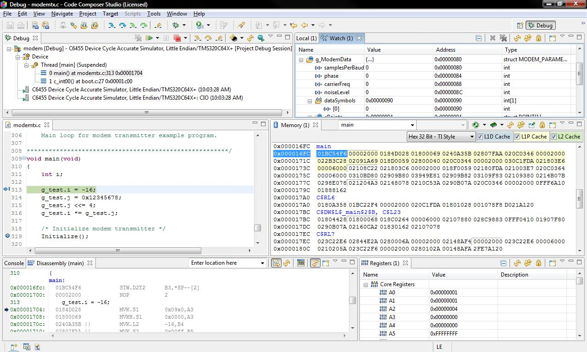

# Tooling   
- [Software](#Software)   
    - [IDE](#IDE)   
    - [GNU Toolchain](#GNU-Toolchain)   
        - [GNU Debugger](#GNU-Debugger)   
        - [Binary Utilities](#Binary-Utilities)   
            - [GNU Size](#GNU-Size)   
            - [NM](#NM)   
            - [Objcopy](#Objcopy) 
            - [Objdump](#Objdump)   
            - [Readelf](#Readelf)   
    - [Make](#Make)   
        - [Make File](#Make-File)   
        - [Memory Map](#Memory-Map)
    - [Application Binary Interface](#Application-Binary-Interface)
    - [Register Definition Files](#Register-Definition-Files)
    - [Linker File](#Linker-File)
    - [Version Control](#Version-Control)   
- [Hardware](#Hardware)   
    - [Selector Guide](#Selector-Guide) 
    - [Product Brief](#Product-Breif)  
    - [Data Sheets](#Data-Sheets)   
    - [Family Technical Reference Manuals](#Family-Technical-Reference-Manuals)   
    - [Chip Errata](#Chip-Errata)   
# Software   
## IDE  
---   
Integrated Development Enviroment is software for building applications. Using IDE has trade off with a user friendly UI but lack other functionality.   

For example IDE will list Makefiles, outputfiles, and executable in the project explorer and dynamically create makefiles through the use of file auto-generation  

This is a great way for a fast start but bad for maintainability and portability.  

Code Composer Studio is the recommended IDE for this course. Click the image for a short tutorial.  

[](https://www.youtube.com/watch?v=SEELbfUnYmA)  


Other IDEs  
- Notepad ++
- Sublime
- Vim
   

## GNU Toolchain  
---   
The main job of the compiler tool set is to translate a high-level language into architecture specific language

#### GNU Debugger
---   

Allows user to see what is going on `inside' another program while it executes -- or what another program was doing at the moment it crashed
   
[Commands](https://github.com/richanynguon/PathToHokage/blob/master/Embedded_System/coursera_ese/src/Quick_Commands.md#GDB)

[Reference](https://www.coursera.org/learn/embedded-software-hardware/lecture/q2KgY/8-debugging-a-microcontroller-program-part-2)

#### Binary Utilities  
---   
Extra programs to help with the process of building  

These include:
- The Assembler (as)
- The Linker (ld)
- Conversion of executables
- Sizing compiled image
- Library/Archive creation
- Symbol Listing Debugging 
- Many more


   
###### GNU Size  
---  

Display the sizes of the compiled sections inside your object files and executable file outputs. This gives you an idea of your memory footprint is for your executable.

[Commands](https://github.com/richanynguon/PathToHokage/blob/master/Embedded_System/coursera_ese/src/Quick_Commands.md#Size)
   
###### NM  
---   
The symbol utility allows us to investigate the size of all the possible symbols that are defined in a given executable or object file.

Symbols are identifiers in your source code that can be referenced
- Variables
- Functions 
- Debug  


Example
- my_file.c contains 5 function definitions, no global variables
- Ending Code Address: 0xBE
	- ~190 Bytes of code Memory
- Biggest Function: set_all
- Smallest Function: clear_value, set_value

| Name        | Starting Address | Code Size [Bytes] |
|-------------|------------------|-------------------|
| clear_all   | 0x00             | 0x22              |
| clear_value | 0x24             | 0x1E              |
| get_value   | 0x44             | 0x1A              |
| set_all     | 0x60             | 0x3E              |
| set_value   | 0xA0             | 0x1E              |

[Commands](https://github.com/richanynguon/PathToHokage/blob/master/Embedded_System/coursera_ese/src/Quick_Commands.md#NM) 

###### Objcopy 
---   
The object copy utility is used to convert object files from one format to another and make a copy of an object files.

Executable output types:
- Binary
- srec (Motorola S-Record)
- intel Hex Record (ihex)
- elf32-littlearm
- elf32-bigarm

[Commands](https://github.com/richanynguon/PathToHokage/blob/master/Embedded_System/coursera_ese/src/Quick_Commands.md#Objcopy) 

###### Objdump  
---   

Dumps information about an object which includes: section header, symbols, and debugging information.  
Objdump can take object files and dumb assembly from the machine code.  

This program allows you to debug symbols from your c-program and assembly to intermix.

[Commands](https://github.com/richanynguon/PathToHokage/blob/master/Embedded_System/coursera_ese/src/Quick_Commands.md#Objdump) 
   
###### Readelf  
---   

Displays information about a ELF formatted files:
- Compiled sections
- Memory section
- Symbol Tables
- Architecture Specifics

[Commands](https://github.com/richanynguon/PathToHokage/blob/master/Embedded_System/coursera_ese/src/Quick_Commands.md#ReadElf) 

## Make  
---   

 A tool to automate the process of compiling files into an executable using a makefile.  Build automation provides a simple and consistent method for producing a target executable. The process incluides preprocessing, assembling, compiling, linking, relocating.  
 
 Make can be invoked from the command line, it has build targets and rules that is defined in the Makefile. Multiple rules can be executed for any given instance of make.

 ```
make // defaults to first defined target in the main files
make all
make clean // generates all the output files
 ```


- makefile, Makefile, sources.mk, include.mk >> defaults make looks for
-  make all, make clean, make main.out, make main.o >> makefiles have build targets or build rules

 Make can also generate object files, dependency files, and map files.

[Commands](https://github.com/richanynguon/PathToHokage/blob/master/Embedded_System/coursera_ese/src/Quick_Commands.md#Make) 


#### Make File
---

Build Rules require a specific syntax of: prerequisites and commands. These are recipes for how to build a particular executable or non-source files. A recipe can only be executed if the dependencies are met.

```
main.out: main.o my_file.o
    gcc -g -Wl, -Map=main.map -o main.out main.o my_file.o

target: prerequisite1 prerequisite2 prerequisite3 // dependencies
       command // recipes
       command // recipes

make my_file.o >>>
my_file.o: my_file.c my_file.h
       gcc -c my_file.c -o my_file.o
```

Makefile syntax  

- Comments starts with "#"
- Can include other makefiles
- Line continuation is done with a \
- Can create and use variables
- can have multiples rules
- commands lines start with a tab
- targets can depend on other targets

Makefile Variables

- Variables can be set to strings of text and can include other variables
    - Variable access is done with the $(variable-name) syntax
- Recursively Expanded Variables (=)
    - Expands whenever used

```
CSTD=c89
CPU=cortex-m0plus
CC=arm-none-eabo-gcc
```

- Simple expanded variables (:=)
    - Expand once at the time of definition

```
// special examples that run linux commands to set data
ARCH:=$(shell arch)
CWD:=$(shell pwd)
OS:=$(shell uname)
```
- Use Variables for things like compiler flags > CLFAGS, Linker flags > LDFLAGS
```
CFLAGS = -g -std=$(CSTD) -mcpu=$(CPU) -mthumb
```

Include Paths and Sources
- Can control what directories and source files are used for building
    - Includes provide path to code (absolute or relative paths)
    - Sources determine what needs to be built
- Can reference a variable for include directories and source files
    - Create dynamics targets instead of statically defined parts

[Source File Example](https://github.com/richanynguon/PathToHokage/blob/master/Embedded_System/coursera_ese/src/Document_Templates.md#Source-File) 

Build the Executable
- Use variables in your target rules
```
main.out: main.o my_file.o
    gcc -Wl, map=main.map -I./inc -o main.out main.o my_file.o
$(TARGET):$(OBJS)
   $(CC) $(CFLAGS) $(INCLUDES) $(LDFLAGS) -o $(TARGET) $(OBJS)
```
- Automatic Variables - variables in a recipe with a scope
```
$(TARGET):$(OBJS)
   $(CC) $(CFLAGS) $(LDFLAGS) $(INCLUDES) -o $@ $^

$@ TARGET
$^ ALL PREREQUISITES
```

Makefiles can be dynamic and eliminates text duplication and other variables can use other variables

```
CPU=cortex-m0plus
ARCH=thumb
SPECS=nosys.specs

PLATFORM_FLAGS:=-m$(ARCH)    \
                -mcpu=$(CPU)    \
                --specs=$(SPECS)    \
```

Pattern Matching Operator (%) matches a target object rules with an associated source file. 

```
%.o: %.c
    $(CC) -C $@ -o $< $(CFLAGS)

$@ TARGET RULE NAME
$< PREREQUISITE NAME >>>>

$make main.o >>>
main.o: main.c
    $(CC) -C main.c -o main.o $(CFLAGS)

OBJS:=$ (SRC:.c=.o) // for every .c file, associate a *.o with the same name
```
Target Suggestions  
Targets do NOT have to be a file  - can make your own target names and needs a .PHONY directive

```
.PHONY: all
all: main.out
main.out: $(OBJS)
        gcc $(CFLAGS) -o main.out $(OBJS)

.PHONY: clean
clean:
    rm main.map $(OBJS) main.out
```
- all: builds final executable binary 
- clean: removes all generated and object file
- debug: builds a debug image with debug symbols enabled

Functions & Dynamic Variables
- Can use make functions to process info
	- Output goes into variables
	- shell, file origin conditional, etc
- Shell functions are one form command expansion that can gather data from the system outside of make
	- Use the syntax $(shell command)
- Use conditional statements to change flags
```
OS:=$ (shell uname -s) // this command will expand on definition
ifeq ($(OS), Linux) // if equipped with OS being linux 
    CC=gcc // variable cc become gcc
endif // end code block
```
Overriding Variables
- Pass input parameters into make to alter build
- Architecture to build for CPU
- Platform/Board
- Compiler Instance
- Compiler/Linker Options

```
make all PLATFORM=msp432
make all CPU=cortex-m4
make all ARCH=arm 
>>>
ifeq ($(PLATFORM),MSP)
    CPU=cortext-m4
endif
ifeq ($(PLATFORM),FRDM)
    CPU=cortext-m0plus
endif
```

Special Variables
- CC - compiler
- CCP - Preprocessor Program
- AS - Assembler Program
- LD - Linker
- CFLAGS - C program flags
- CPPFLAGS - C Preprocessor Flags
- ASFLAGS - Flags for ASsembler
- LDFLAGS - C Program Linker Flags
- LDLIBS - Extra flags for libraries


[Makefile Example](https://github.com/richanynguon/PathToHokage/blob/master/Embedded_System/coursera_ese/src/Document_Templates.md#Make-File) 

## Memory Map
---

A memory map is a document that provides a memory address to a physical device mapping within an address space for use in programming.

## Application Binary Interface
---
Application Binary Interface (ABI) provides architecture details to compiler/software programmer.

## Register Definition Files
---
The details on platform specific registers can be put in C programming source files. Addresses can be used as pointers to memory. When software is interacting with peripheral address to make the code platform more portable and reusable - register definition files are used.  

Platform File that provides interface to peripheral memory by specifying
- Address list for peripherals
- Access methods
- Defines for bit fields and bit masks

## Linker File 
---
The compiled memory sections of a compiled executable will be relocated by referencing a symbol name. Symbol names are referred to as memory sub segments.
## Version Control  
---   

 A system that manages a program.  

 Git is a popular version control system.  

[Commands](https://github.com/richanynguon/PathToHokage/blob/master/Embedded_System/coursera_ese/src/Quick_Commands.md#Git)  

Other systems:  
- Concurrent Versions System
- Subversion
- Mercurial
- IBM Rational ClearCase


# Hardware   
## Selector Guide  
---
   
A parametric tool that allows you to find and compare the specifications and features of devices  

## Product Brief   
---   
A brief which gives concise overview of a product, talks about use cases, gives more detailed feature specifications.

## Data Sheets  
---   

Data sheets are an informative dense read that contains detailed technical specifications
These can contains types of details like such:
- Electrical
- Timing
- Environmental
- Physical Package


   
## Family Technical Reference Manuals  
---   
A manual that gives information about
- Configuration Details 
    - Functional description
    - Register description
    - Addresses
- Operation descriptions
    - Order of operations
- Used to write Bare-Metal Firmware


   
## Chip Errata  
---   
   
A document that shows error descriptions  and provides corrective information or workaround to issue

